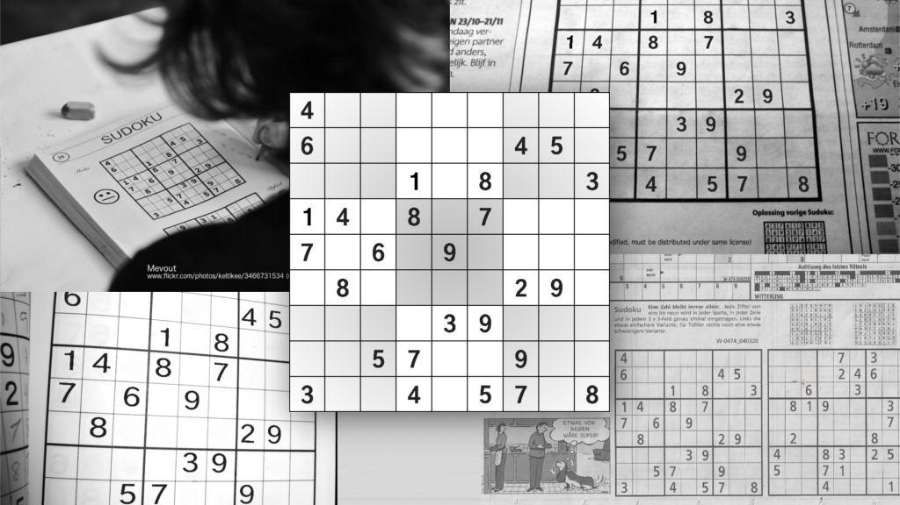
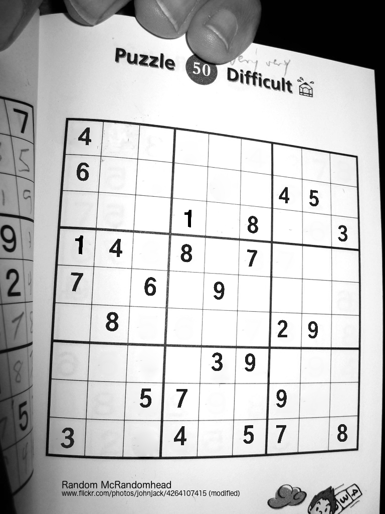
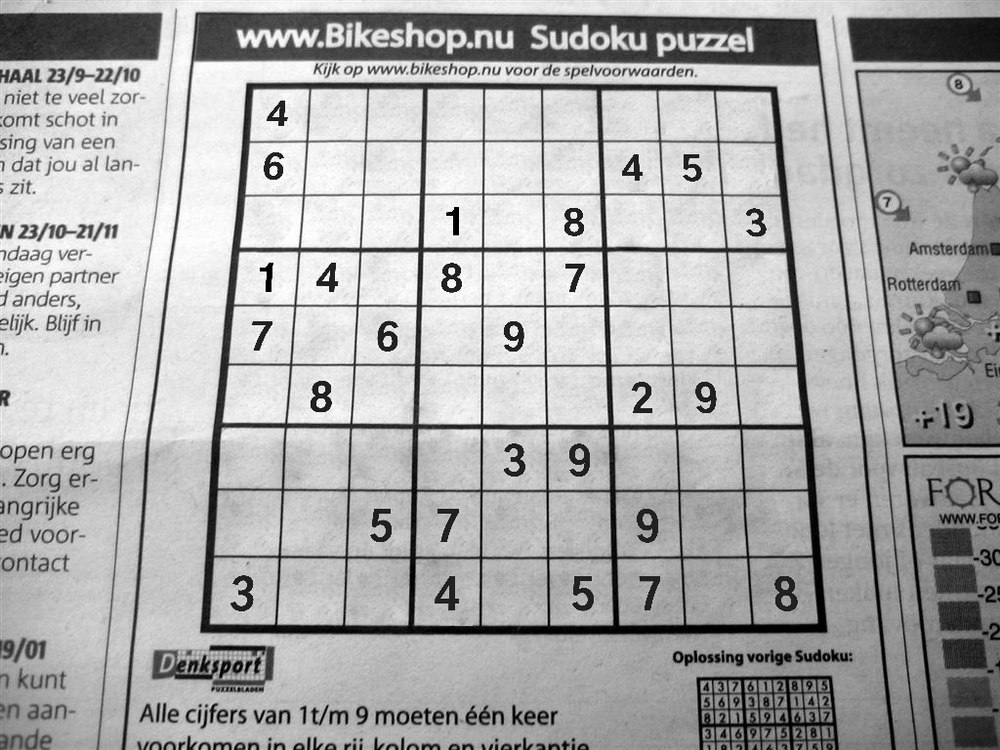
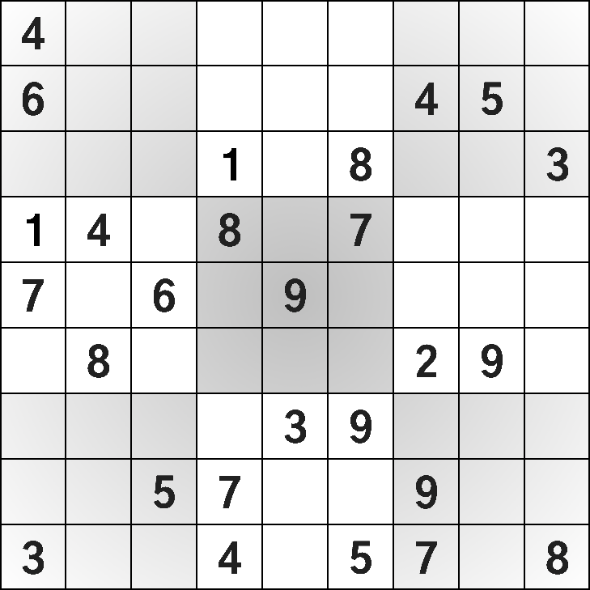

# Sudoku Image Generator



## My Mother is a Sudoku Enthusiast

Every morning, she solves the Sudoku puzzle in the daily newspaper and quietly sips her coffee throughout the mental exercise.
Eventually, my father started to join the competition, so the two had to copy the puzzle every morning.
Today, the ritual has reached a point at which their newspaper subscription exists for the sole purpose of delivering a daily Sudoku puzzle.

In my eyes, this waste of money, paper, and ink had to stop and my first attempt was a Sudoku puzzle generator, like there are probably many around already.
Anyways, I would learn a few new things along the way and my parents would be flooded with puzzles.
However, it turns out that neither of them accepted my generated puzzles.
They were simply not authentic enough and couldn't reach up to the newspaper experience.

The "look and feel was not the same" and the puzzles were "too difficult", they said.
So, I went ahead with a scanned copy of their preferred format and built this second generator around it.
The result: a Sudoku puzzle generator that mimics the desired look to a degree that is indistinguishable from the original.

## Generate Your Own Sudoku Puzzles

You need no more than Python3 and the [OpenCV](https://pypi.org/project/opencv-python).

From there, it's all embedded in a simple Python script.
Use it with one of the provided templates, e.g. `templates/newspaper`.
The generated Sudoku image will appear relative to your working directory.

```sh
./gensudoku.py -t templates/newspaper -o my-first-sudoku.png
```

## Examples


These Sudokus were generated in the format of aforementioned newspaper.
Find the template in `templates/newspaper`.



Results can be more artistic.
This example is derived from a [photo](https://flickr.com/photos/keltikee/3466731534) by [Mevout](https://flickr.com/photos/keltikee) that I found on Flickr.
Find the corresponding template in `templates/book`.



Another [photo](https://flickr.com/photos/azriel100/214950693) from Flickr, this time by [David_Beltra_Tejero](https://flickr.com/photos/azriel100/), let to the template `templates/newspaper-2`.


The third and last Flickr-based template was derived from a [photo](https://www.flickr.com/photos/johnjack/4264107415) by [Random McRandomhead](https://www.flickr.com/photos/johnjack).
Find the template in `templates/book-2`.



And for those of you who want no more than a plain Sudoku puzzle, there is also the minimalistic template `templates/plain`.
