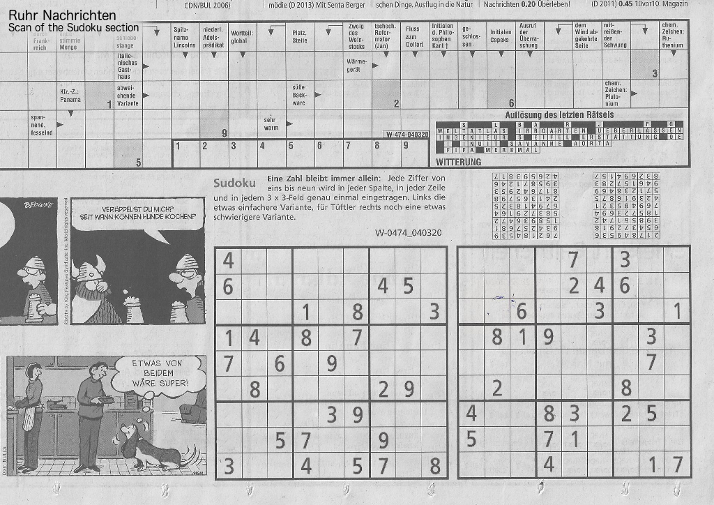

# Sudoku Puzzle Generator 


## My Mother is a Sudoku Enthusiast

Every morning, she solves the Sudoku puzzle in the daily newspaper and quietly sips her coffee throughout the mental exercise. 
Eventually, my father started to join the competition, so the two had to copy the puzzle every morning. 
Today, the ritual has reached a point at which their newspaper subscription exists for the sole purpose of delivering a daily Sudoku puzzle. 

In my eyes, this waste of money, paper, and ink had to stop and my first attempt was a Sudoku puzzle generator, like there are probably many around already. 
Anyways, I would learn a few new things along the way and my parents would be flooded with puzzles. 
However, it turns out that neither of them accepted my generated puzzles. 
They were simply not authentic enough and couldn't reach up to the newspaper experience.

The "look and feel was not the same" and the puzzles were "too difficult", they said. 
So I went ahead with a scanned copy of their preferred format and built this second generator around it. 
The result: a Sudoku puzzle generator that mimics the desired look to a degree that is indistinguishable from the original.

## Generate Your Own Sudoku Puzzles

It's embedded in a simple Python script. 
Use it with one of the provided templates, e.g. `templates/newspaper`.

```sh
./gensudoku.py -t templates/newspaper -o my-first-sudoku.png
```

## Examples



This Sudoku was generated in the format of said newspaper. 
Find the template in `templates/newspaper`. 


This template is derived from a [picture](https://www.flickr.com/photos/johnjack/4264107415) from [Random McRandomhead](https://www.flickr.com/photos/johnjack/) that I found on Flickr. 


A plain template for those who just want to generate Sudoku puzzles. 
For this result, use the provided template `templates/plain`.


 
